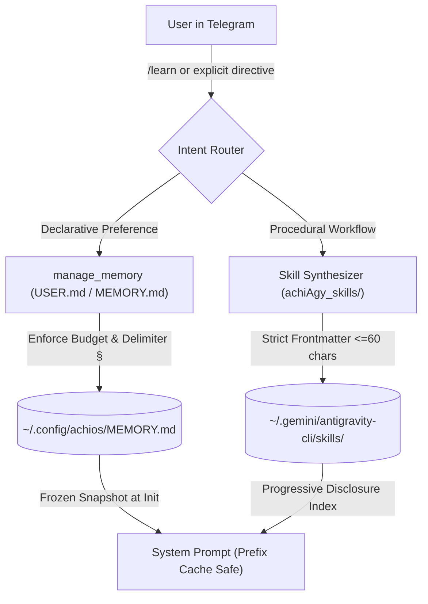

# 🧠 Hermes Agent Self-Learning Loop Architecture & achiAgy Blueprint

* **Date:** August 19, 2026
* **Source System:** NousResearch Hermes Agent (`~/.hermes/hermes-agent`)
* **Auditor:** Claude Opus Deep Architecture Auditor
* **Target Integration:** `achiAgy` Telegram Bot (`achiOS`) & Universal Multi-Agent Orchestrator

---

## 🎯 1. Executive Summary & Why Hermes Succeeds

Where our previous correction harvester failed (brittle regex pattern-matching mistaking ephemeral dialogue for permanent rules), **Hermes Agent solves the self-learning loop through 4 architectural pillars**:

1. **Explicit Intent & Structured Synthesis (`/learn`)**: Learning is not a passive regex scrape of messy chat logs. It is an agentic tool-driven workflow triggered either explicitly by `/learn` or during structured consolidation passes.
2. **Dual-Track Knowledge Representation**:
   * **Declarative Memory (`MEMORY.md` & `USER.md`)**: Delimited facts, preferences, and profile constraints with strict character budgets.
   * **Procedural Skills (`skills/<name>/SKILL.md`)**: Full executable runbooks with standardized sections (`Prerequisites`, `Procedure`, `Pitfalls`, `Verification`).
3. **Progressive Disclosure & Frozen Prompt Caching**:
   * Declarative memories are injected at session start as a **frozen snapshot** to maintain 100% LLM prefix cache hits.
   * Procedural skills are indexed via **ultra-short ≤60-character descriptions**, and full skill bodies are dynamically loaded on-demand via `view_file` / `skill_view`.
4. **Self-Balancing Character Budgets & Memory Mutations**:
   * Strict character limits (e.g., 2,200 chars) force the LLM to prune, merge, or replace outdated entries using atomic `apply_batch` operations rather than endlessly appending unvetted text.

---

## 🔬 2. Deep Dive: Hermes Core Mechanics

### A. The `/learn` Authoring Engine (`agent/learn_prompt.py`)
When a user instructs `/learn <topic or request>`, Hermes builds a specialized authoring prompt:
* **The 60-Character Hard Constraint:** Frontmatter descriptions must be $\le 60$ characters. Hermes's runtime router truncates anything longer, so descriptions must be concise, laser-accurate routing triggers.
* **Hermes-Tool Framing:** The generated procedure must use the agent's actual tool vocabulary (e.g., `read_file`, `write_to_file`, `run_command`).
* **Source Hygiene & Prompt Injection Defense:** Explicitly filters out bidirectional/invisible unicode characters to prevent Trojan Source attacks from ingested web text.

### B. Declarative Memory Engine (`tools/memory_tool.py`)
* **Delimiter-Based Storage:** Stored in `MEMORY.md` and `USER.md` separated by `\n§\n`.
* **Atomic Mutations:** Supports `add`, `replace`, `remove`, and `batch`.
* **Budget-Enforced Compaction:** When storage exceeds the token/character threshold, the tool rejects uncompacted appends, forcing the LLM to synthesize older entries.

### C. Skill Lifecycle & Graph Pruning (`agent/learning_graph.py`)
* Skills are stored as `SkillNode` objects tracking usage count, timestamps, category, and relational edges to other skills.
* Background review forks automatically detect overlapping skills and consolidate them into umbrella skills (`absorbed_into=<umbrella>`).

---

## 🛠️ 3. Implementation Blueprint for achiAgy Telegram Bot

To replace the flawed regex harvester with Hermes's robust self-learning loop in `achiAgy` (`@achiAgyOSBot`):

### Step 1: Storage Layer
* Create `~/.config/achios/MEMORY.md` (bot facts/constraints) and `~/.config/achios/USER.md` (Aki's profile/preferences) using `\n§\n` delimiters.
* Set a hard 2,500-character budget per file.

### Step 2: Implement `manage_memory` Tool in achiAgy
Equip `achiAgy` with an atomic memory management tool:
* `action: "add" | "replace" | "remove" | "batch"`
* Validates unique substring matches before mutating.
* Rejects writes that exceed budget unless a `batch` consolidation is provided.

### Step 3: Progressive Skill Synthesis
* Replace `extract_corrections.py` regexes with a dedicated `/learn` command and LLM validation pass.
* Write reusable workflows into Antigravity skill folders (`SKILL.md`) matching the standard frontmatter format.

### Step 4: System Prompt Caching Architecture
* Load `USER.md` and `MEMORY.md` as frozen text blocks on session launch.
* Inject only the lightweight skill index (name + 60-character description) into the initial context.
