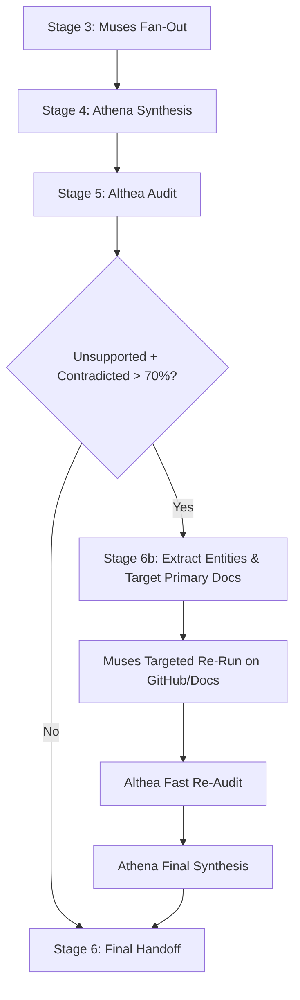

# Asa Research Failure Modes & Unsupported Claims Audit

**Date:** 2026-08-28  
**Author:** Agi & Aki Bukuhan  
**Status:** Settled / Ready for Planning & Implementation  
**Target Repository:** `~/Code/GitHub/asa`  
**Task Reference:** [tasks.md](http://100.106.210.38:8999/Code/GitHub/AIS-OS/tasks.md)  
**Deliverable Document:** [2026-08-28-asa-research-failure-modes-and-retry-loop-audit.md](http://100.106.210.38:8999/Code/GitHub/AIS-OS/docs/2026-08-28-asa-research-failure-modes-and-retry-loop-audit.md)

---

## 1. Executive Summary

During the Asa STORM 5-lens research run on *Whisper Flow Free & Open-Source Alternatives* (2026-08-28), two significant runtime failure modes were identified:
1. **`asa status` CLI Crash:** An unhandled `FileNotFoundError` caused `asa status` to crash across the entire session when unmanaged data directories existed inside `~/.local/share/asa/runs/`.
2. **High Althea Unsupported/Contradicted Rate (74%):** Out of 23 audited claims in the research synthesis, 14 were graded `Unsupported` and 3 `Contradicted`, leaving only 6 `Supported` claims.

This audit documents the mechanical and epistemic root causes of these failures and defines the implementation requirements for Claude Code to patch `asa status` and integrate an automated Althea-to-Muses retry loop.

---

## 2. Failure Mode 1: `asa status` Metadata Crash

### Incident & Traceback
When invoking `asa status`, the command threw an immediate unhandled exception:

```
FileNotFoundError: [Errno 2] No such file or directory: '/home/achibukz/.local/share/asa/runs/extracted_responses/meta.json'
```

### Root Cause
In `asa/sidecar.py` and `asa/cli.py`, `sidecar.all_runs()` naively iterated over every child directory inside `~/.local/share/asa/runs/` and attempted to read `meta.json`. Because utility folders (`extracted_responses/` and `extracted_texts/`) were placed in the runs directory without metadata files, the scan aborted before displaying any run status.

### Permanent Fix Required in `asa`
Harden `sidecar.py` to defensively filter directory entries:
```python
def all_runs() -> list[Path]:
    if not RUNS_DIR.exists():
        return []
    return [
        d for d in RUNS_DIR.iterdir()
        if d.is_dir() and (d / META).is_file()
    ]
```

---

## 3. Failure Mode 2: High Unsupported & Contradicted Claims (~74%)

### Audit Metrics
```
Claims Audited: 23
Supported: 6 (26%)
Unsupported: 14 (61%)
Contradicted: 3 (13%)
Fabricated Sources: 0 (0%)
```

### Root Causes

#### A. Citing Marketing Landing Pages Instead of Raw Code/Documentation
Muses frequently cited top-level marketing domains (e.g., `macwhisper.com`, `superwhisper.com`, `aquavoice.com`).
- These sites are client-side JavaScript/Framer applications. When Althea fetched raw HTML via HTTP or web search, it retrieved only high-level marketing copy (e.g., *"Voice to text that works in any app"*).
- Technical assertions (such as whether MacWhisper free is batch-only, or whether Superwhisper uses local vs cloud models on the free tier) were omitted from raw HTML, leading Althea to strictly flag them as `Unsupported`.

#### B. Domain Guessing & Parked Domains
Muses cited `openwhisper.com` for OpenWhispr.
- `openwhisper.com` is a parked domain with a redirect script.
- The actual project documentation lives on GitHub at `github.com/OpenWhispr/openwhispr`. Because Althea inspected the parked landing page, all claims linked to that domain failed.

#### C. Composite Claims & Internal Knowledge Leakage
Muses blended verified facts with its own pre-trained background knowledge, but attached the whole composite sentence to a single URL citation:
- **Example Claim:** Handy requires *"Microphone and Accessibility (Input Monitoring/Key simulation) permissions in System Settings -> Privacy & Security"*.
- **The Source Text:** Handy's README only says *"grant necessary system permissions (microphone, accessibility)"*.
- Because the parenthetical technical detail (*Input Monitoring / Key simulation*) was added by Muses from general macOS knowledge rather than quoted from the README, Althea strictly graded it `Unsupported`.

#### D. Althea's Literal Zero-Trust Standard
Althea operates under an absolute zero-trust verification rule. If a claim has two factual assertions and only one is supported by the quoted source text, the entire claim is marked `Unsupported`:
- **Example Claim:** *"Superwhisper provides a free tier with unlimited use of small on-device models"*.
- **The Source Text:** *"Free $0... Unlimited use of Whisper models"*.
- Because the source text did not explicitly contain the exact tokens *"small on-device"*, Althea refused to infer it.

#### E. Numerical Approximations (Contradicted Claims)
Muses approximated numbers from memory rather than verifying exact strings:
- **Groq Rate Limits:** Muses claimed 30 RPM; Groq's live documentation states 20 RPM (Contradicted).
- **whisper.cpp Memory:** Muses claimed 10GB system RAM overhead; whisper.cpp's benchmark table lists ~3.9 GB (Contradicted).

---

## 4. Proposed Architectural Fixes & Implementation Plan

### Fix 1: Prompt & Source Constraints for Muses (`asa/agents/muses.md`)
1. **Ban Root Domains:** Muses must be strictly instructed to avoid citing top-level root domains (`.com/`, `.org/`). All citations must point to deep resource URLs (`/README.md`, `/docs/`, `/releases`, `/paper.pdf`, GitHub issues).
2. **Atomic Claims:** Mandate that Muses output atomic, single-fact statements rather than multi-clause sentences, preventing background knowledge from poisoning verifiable citations.

### Fix 2: Automated Althea-to-Muses Retry Loop (`asa/workflows/research.md`)
Introduce **Stage 6b (Automated Query Refinement & Re-Run)** into the research workflow:



1. **Threshold Trigger:** If `althea` reports an unsupported/contradicted rate exceeding **70–80%** (or if `FABRICATED SOURCES > 0`):
   - Asa halts final synthesis and triggers a targeted Muses re-run.
2. **Query Extraction:** The orchestrator extracts the unsupported entities (e.g., repository names, rate limits, model parameters) and instructs Muses to search exclusively within primary documentation (`site:github.com`, `site:arxiv.org`, official API docs).
3. **Differential Audit:** Althea audits only the newly fetched citations before Athena produces the final locked dossier.

---

## 5. Next Steps for Claude Code

1. Update `asa/sidecar.py` to harden `sidecar.all_runs()` against directories lacking `meta.json`.
2. Update `asa/agents/muses.md` with strict primary-source citation rules and atomic claim constraints.
3. Update `asa/workflows/research.md` to specify the Stage 6b automated retry threshold and query refinement procedure.
