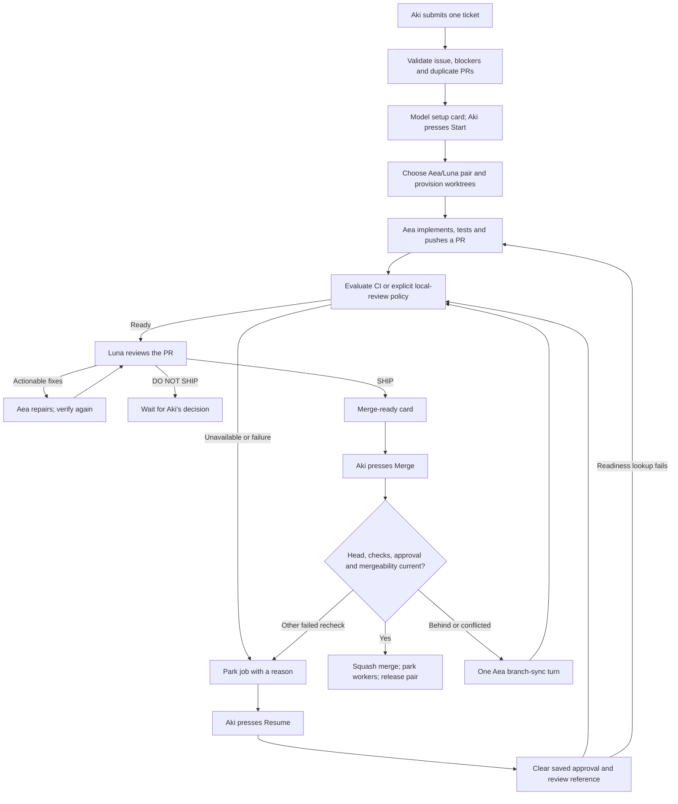
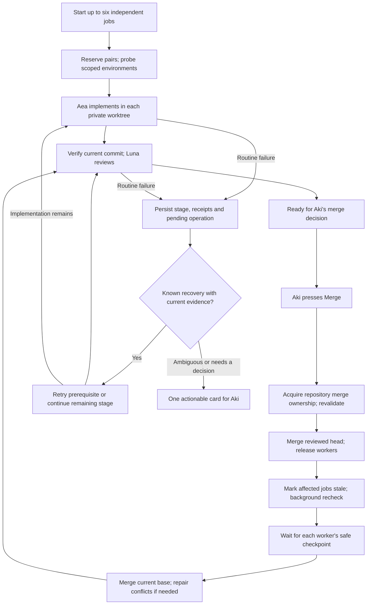

# Autonomous worker loop audit, 2026-09-05

## 2026-09-05 deployment update

[achiCore #153](https://github.com/achibukz/achiCore/issues/153) is closed at Aki's request. [PR #154](https://github.com/achibukz/achiCore/pull/154) is merged as `bbb8fb73a6b1ba3632187df3b9ee45b31b4d3af1` and the main hub restarted on that code at 18:45 UTC. Telegram polling succeeded. Bindings and conversation IDs were preserved.

Remaining worker work is [#155](https://github.com/achibukz/achiCore/issues/155), separate conflict-repair attempts and Atlas repair/merge-queue status, and [#156](https://github.com/achibukz/achiCore/issues/156), invalidating cached probes when a worker virtualenv disappears or changes. Neither follow-up is implemented. Background preparation and automatic recovery retain their default-off production settings.

Aki's Flash staging run produced five completed jobs and one abandoned job. It did not establish six simultaneous jobs, all-engine coverage or the full fault-injection matrix. Closure and deployment do not mark those gates passed. See the [deployment and test record](http://100.106.210.38:8999/Code/GitHub/achiCore/docs/issue-153-deployment.md) for commands, counts, receipts and limits. Learning T1 through T9 and the control board remain separate work; this deployment does not establish learning completion.

The original brief or audit below is retained as a historical source. Its present-tense observations refer to its original checkout.


Scope: inspect the current `/ToWork` lifecycle, concurrency, recovery, merge preparation, Claude Code fallback and testing arrangements. Aki wants six independent jobs to produce reviewed PRs with routine recovery unattended. Self-learning can ship independently and work can progress on both deliverables. The control board comes later.

The [consolidated implementation brief](http://100.106.210.38:8999/Code/GitHub/AIS-OS/docs/astra-autonomous-loop-ticket.md) owns proposed changes. This audit describes observed source and stored state. It did not run six production jobs or restart a service.

## Evidence and limits

achiCore was at `4ff50b5786bca1fc111bab2378835b1294063877`. AIS-OS advanced during the audit from `823b932` to `efe250dce545e29104c01772301b8c66d57eca11` as the separate Claude Code work updated its local-review command. Those edits were preserved.

GitHub showed #128 and #113 closed, merged through PRs #150 and #151. PR #151 merged at 10:39:10 UTC. The bot process read from `/proc` started at 12:33:57 UTC from the main achiCore checkout using `.env.hub`; that supports a post-merge launch but does not establish its loaded source hash or prove every live CI-policy path. The unit is a tmux launcher and reports active/exited with MainPID 0, so that property alone does not mean the hub is down.

The stored hub records contained 15 jobs, 13 completed and 2 abandoned, and 13 finished review loops. None was active at inspection. The #113 job finished on attempt 5. The #118 job finished on attempt 3 with two environment-related history entries. Those records establish repeated attempts, not a measured token cost or a current six-job failure.

There were no open achiCore PRs when queried. Related pending tickets were inspected rather than inferred from the dated plan. Full live throughput, actual quota behavior and staging isolation remain unexercised.

## Current flow



The diagram abbreviates the existing three-cycle review bound and two-CI-repair bound. Nits-only is a distinct outcome that returns for Aki's decision. A quota or terminal worker failure can also park the job. The existing Merge tap already attempts one branch sync, so the missing behavior is early preparation and reliable recovery, not the absence of all sync code.

## Findings

| Finding | Source or observation | Effect and required work |
|---|---|---|
| Different jobs can select the same unreserved pair | `src/to_work.py:167` computes the next slot from registered topics. `src/bot.py:3032` chooses the pair, then awaits identity validation and provisioning before the topic records exist. `to_work_starting` reserves an issue key only. | A forced interleaving can select the same pair. Git's path refusal may stop one attempt, but this is not successful concurrent admission. Reserve the pair across awaits and test rollback ownership. This is a source-level race finding, not a live corruption reproduction. |
| Environment preparation is still paid-agent work | `src/worktrees.py:113` provisions a detached Git worktree. There is no actual scoped-engine dependency/process probe before `_run_to_work_job` dispatches. | Preserve #128's runner and implement #146's preflight, isolated environments and cached evidence. |
| Resume invalidates useful evidence unconditionally | `src/to_work.py:674` clears `approved_head_sha` and `review_loop_key`. `_start_owned_review` creates another record under the existing review key. | An unchanged approved PR can repeat review and lose earlier cycle detail. Preserve versioned attempts and revalidate them. |
| Infrastructure errors can request implementation again | `src/bot.py:2474` catches readiness-related errors on resume and sets readiness to None. That takes the full implementation dispatch path. | Distinguish missing prerequisites and transient reads from code defects. Fingerprint unchanged failures. |
| Sync starts at the user's Merge tap | `src/bot.py:2747` discovers behind/conflicting status and calls `_sync_and_rereview`. No background preparation path updates other ready jobs after a merge. | Add bounded monitoring and serialize branch updates with active work. A new head requires fresh verification and approval. |
| Merge ownership is per job rather than per repository | `to_work_tasks` guards each job. `WorkspaceLocks` keys model turns by resolved workspace. `_merge_or_finish_to_work` has no common repository merge lock. | Distinct jobs can validate against the same base concurrently. Serialize merge decisions and recheck after ownership acquisition. GitHub may refuse one request, but that is still a recoverable race to handle. |
| Claude failures cannot trigger quota fallback | `src/claude_client.py` has no `detect_quota_wall` or `written_paths`. Common wrappers use optional attributes. The Claude command also lacks the shared Landlock wrapping. | Complete #121/#122/#123 in order, preserving shared delivery, identity and recovery. Subscription allowance reporting does not establish fallback support. |
| First-write fallback rules alone do not provide unattended job continuation | The shipped fallback permits retry only before a possible write. Later failures end the turn. | Keep that rule. Job-level recovery must inspect a stopped worker's checkpoint before continuing remaining work, and park unknown external side effects. |
| Worker runbooks conflict | Aea/Luna forbid subagents, but allowlisted `code-review` requires them. `implement` delegates most work through slash instructions. | Provide reviewed unattended workflows with explicit ownership and runnable steps. |
| Reviewer branch preparation is still ambiguous | Luna's persona now uses the provisioned worktree and `scripts/run_tests.py -q`, but says `git checkout <headRefName>`. | Pin the review checkout to the recorded head. Avoid checking out a branch already held by the writer. Read relevant AIS-OS context at a recorded revision. |
| Staging isolation needs more than INSTANCE_NAME | State can be instance-specific, while engine homes and several destinations derive from other configuration. | Isolate bot credentials, forum, state, homes, worktree roots and destinations before autonomous Telegram fault tests. |

## What has already improved

#128 provides one repository-owned runner, declared test dependencies, sibling resolution independent of HOME and corrected shared pre-push hook lookup. #113 provides explicit no-CI policy, required check/status inspection and named CI states. The code still has to prove the requested live workflow, but these implementations are present.

AIS-OS's base branch now contains `.achicore/review-policy.json`. Its command names `/home/achibukz/.local/share/achios/venv/bin/python -m pytest -q tests/`. This fixes the separate configuration gap without treating missing workflows as permission to bypass checks. Preserve the other task's current work and recheck its completion before implementation.

Worktree separation, same-workspace turn locks, one-hop delegated ownership, bounded review/repair, explicit merge approval and merged-only cleanup already exist. The consolidated ticket audits their remaining criteria rather than rebuilding the whole coordinator.

## Proposed flow after consolidation



The background component schedules the existing writer. It need not be a new permanent model agent. Independent coding remains concurrent; each worktree mutation and repository merge has one owner. A base change can still require time for tests and review. The benefit is starting that preparation before Aki returns, not promising that every sequence of merge taps completes instantly.

## Telegram staging

A separate hub is the right place for repeated automated checks. Use a separate token and forum, isolated state and engine homes, test repositories and fixture services. Prevent synthetic events from entering production learning. Keep production service restarts and arbitrary privileged shell commands outside this scope.

Automated replay can exercise handlers, state transitions and callback logic. Outbound staging API calls can exercise actual Telegram delivery. A short real-user phone test still verifies incoming commands and buttons. Telegram excludes messages from other bots, so a second bot cannot impersonate the inbound user for this check. [Telegram's bot FAQ](https://core.telegram.org/bots/faq#why-doesn-39t-my-bot-see-messages-from-other-bots).

## Automated verification observed

The first command named a nonexistent `tests/test_worktrees.py`; pytest exited 4 and ran no tests. Correcting that path and including the actual coordinator tests produced this result:

```bash
scripts/run_tests.py -q tests/test_to_work.py tests/test_to_work_command.py tests/test_autoreview_loop.py tests/test_bot_routing.py tests/test_review_loop.py tests/test_review_handoff.py tests/test_ci_policy.py tests/test_failover.py tests/test_claude_client.py tests/test_worker_worktrees.py tests/test_workspace_lock.py tests/test_workspace_lock_pipeline.py
```

Observed result: `488 passed in 34.12s`.

Receipt: achiCore `4ff50b5`; CPython 3.11.16 from the checkout `.venv`; dependency manifest hash `21af2b9243449ee1`; AIS-OS `efe250dce545e29104c01772301b8c66d57eca11`; declared AIS-OS revision `01e00b9607c18e7ccb4afceae344f1fd81507513`. Actual and declared sibling revisions are reported separately by the runner.

These tests cover existing behavior. The proposed six-job scheduling, checkpoint recovery, background merge preparation and staging gates need new regression coverage and live verification. No production state, service, account credential, Calendar or vault content was changed by this audit.

## Merge requested during consolidation

Aki asked to merge the current PR before continuing. PR #152 was reviewed locally and merged through GitHub at 12:46:16 UTC with all three Python 3.11, 3.12 and 3.13 CI jobs successful on head `45f372727f6d7cd1505bc16e61c75c2c24c51977`. The main checkout fast-forwarded cleanly to `a1c5d9e33293d0e73624746e96a7179fe8d4a8d5`. The running hub was not restarted.

That PR adds early `ci_undeclared` refusal. Its base-head probe can miss an external provider that reports only on PRs. This remains a scoped regression case for #153; no failed probe may authorize a review-policy downgrade. PR #152's report records a live local-review check on AIS-OS PR #19 with 311 tests passed. That is the other task's reported evidence, not a live check repeated by this audit.
