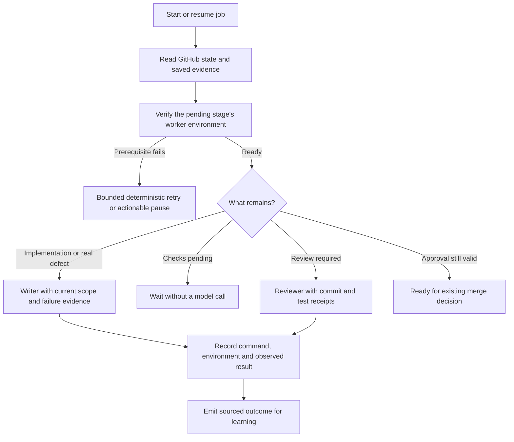

# Astra plan for autonomous learning and connected workflows

Implementation plan, 2026-09-05 UTC. This replaces the earlier Astra planning checklist. The audit and design are complete; the proposed runtime changes have not been implemented.

The [first audit](http://100.106.210.38:8999/Code/GitHub/AIS-OS/docs/2026-09-05-astra-cohesion-audit.md) remains the historical snapshot. This plan uses a fresh code, GitHub and runtime check, plus Aki's decisions in this task. The design discussion is [achiCore #83](https://github.com/achibukz/achiCore/issues/83). Aki approved the ticket breakdown, and #83 is now closed as a completed design discussion with links to its open implementation tickets.

## What must work when this is finished

Aki should be able to use Telegram normally. The system learns from his requests, corrections and verified work outcomes. It applies relevant learning to later requests without a `/learn` command, a manual session export, or a conversation reset.

These are the first acceptance scenarios, using Aki's examples.

| Request or event | Automatic result |
|---|---|
| A gala or meetup with friends | Create the Calendar event. Do not create a task entry. |
| A quick task or a ticket to work on | Capture it in tasks.md. Do not create a Calendar event. |
| A school deadline | Create a task and its linked Calendar deadline. |
| "No, don't add that in GCal, just tasks.md" | Correct the current item's placement, save the correction, and adapt future matching requests. |
| A linked GitHub ticket finishes | Move its existing task to Done once and include the verified result in the debrief. |
| "Take note of this" | Save a sourced note to its domain's permitted knowledge destination and return a link. |
| A later related request | Retrieve current facts, relevant procedures and applicable placement preferences before acting. |

The first three rows are initial preferences. They are editable, sourced learning, not permanent conditionals hidden in Python.

A successful release closes the whole sequence: request, intended action, observed result, correction or useful lesson, durable storage, later retrieval, later outcome. Storing more notes alone does not meet the goal.

## What changed since the first audit

Code inspected at achiCore `c75988f446c7cf4a2d1854af086dff80d32ed49a` and AIS-OS `e3bf08ec570bd8ea2a7fe99525694bd0c502af0c`. Runtime observations were taken on 2026-09-05 around 07:12 to 07:18 UTC. These are observations of a changing system.

| Finding | Current evidence | Implication |
|---|---|---|
| Telegram history still misses the knowledge path | Inline TGDB capture is disabled; vault sync watches inbox only | Replace the capture path before enabling broad learning. |
| Memory still has a second writer | 148 latest ledger records: 59 written, 79 rejected, 10 pending. Of the writes, 50 are CLI, 8 loop, 1 legacy | Every learning mutation needs the same policy and provenance checks. |
| Pending work can sit indefinitely | Oldest pending record is dated August 27 | A persistent worker must process queued evidence even when a topic goes quiet. |
| Memory capacity remains tight | MEMORY.md is 2,388 characters and USER.md is 2,493, each against 2,500 | Remove oldest-entry eviction and keep detailed knowledge outside the global prompt. |
| Recall differs by engine | Antigravity and Codex receive the frozen prompt on the first turn. Claude Code receives it on every invocation | Add bounded current recall on each turn across the common pipeline. |
| Procedure publication is incomplete | `/learn` names the obsolete Antigravity directory. The Skillshare source directory is not a Git repository | A working procedure needs a reviewed source, a publisher and verified discovery through persona allowlists. |
| The first audit's failing test baseline is outdated | AIS-OS now passes 300 tests. achiCore passes 1,260 with one existing skip | Reconcile open tickets against code rather than treating every open issue as unimplemented. |
| Google is no longer wholly disconnected | Calendar-list reads succeeded for personal, work, main and dlsu | Preserve the current gws path. No Calendar write was exercised in this audit. |
| Vault backup status still understates dirty work | achiMem has 17 changed Git status entries. Cached upstream comparison is level | An inbox-only success must not claim the whole vault is backed up. |
| The trackers and documentation drift | GitHub showed 26 open achiCore and 7 open AIS-OS issues; several describe behavior now present | New tickets should link existing work and require verification of remaining scope. |

Runtime state contained 10 bindings, 17 topic definitions, 11 sessions, 12 ToWork records and 11 review-loop records. These counts describe stored records, not active jobs. Four failure-alert service instances remained failed. The audit did not restart services or modify production memory, vaults or calendars.

The first audit's viewer, historical log, media replication and repository cleanup findings remain separate work. Their current resolution was not established here. They do not all need to finish before one useful learning loop can ship.

## Decisions made with Aki

- Cover Telegram coding, personal planning and knowledge capture first. Keep the record format usable by other clients later.
- Capture, validate, store and reuse eligible learning automatically. `/learn` is optional compatibility only and is never a required step.
- Use one successful procedure execution with relevant checks as sufficient evidence for scoped reuse. Record its repository, tool version and prerequisites.
- Generate proposed shared skill and operating-rule changes automatically. Publish them through reviewed pull requests.
- Share relevant knowledge within its domain. Cross-domain retrieval needs an explicit connection to the current request.
- Permit automatic wiki writes on five named achiMem pages, within the sections below.
- Use at most 24 short Flash review calls per Manila calendar day. Continue capture when the budget is exhausted.
- Include routine learning in one daily digest. Alert separately for conflicts, failed actions and required user decisions.
- Audit and fix the worktree, test-environment and autonomous-recovery failures that make later jobs repeat environment work. Keep their verified outcomes available to learning.

The automatic wiki allowlist is exact.

| Page | Allowed mutation |
|---|---|
| `wiki/personal/systems/achi-os.md` | Update a designated sourced system-status section. |
| `wiki/personal/systems/achi-core.md` | Update a designated sourced system-status section. |
| `wiki/personal/systems/achibuntu.md` | Update a designated sourced system-status section. |
| `wiki/personal/timeline.md` | Append verified completed-work rows. |
| `wiki/personal/decisions.md` | Append Tooling / workflow rows linking to the original decision. |

New section markers and the changed automation contract require a reviewed implementation change before the writer is enabled. No writer may expand its own allowlist. Other personal notes can be saved and recalled automatically from sourced raw session records. School notes use schoolMem inbox; schoolMem wiki remains under its existing ingest contract.

## Ownership and storage

Keep one owner for each fact or field. Use a local coordination database for relationships, evidence, learning revisions and retries. Do not move every existing store into it.

| Record | Owner | Related representation |
|---|---|---|
| Personal task title, priority, state and due date | AIS-OS tasks.md and explicitly included backlog files | Digest and Telegram task card |
| Calendar-only appointment and its time | Google Calendar | Coordination record, with no task line |
| Deadline represented in both places | Task owns the due date; the linked deadline event reflects it | Changes made directly in Calendar are reconciled and ambiguous changes ask once |
| Repository issue and completion state | GitHub | Optional linked task; debrief completion entry |
| Personal or school knowledge | The appropriate vault | Rebuildable search index and bounded recall |
| Build and tooling decisions | AIS-OS decisions/log.md or the relevant repository's decision record | One-line pointer from achiMem when appropriate |
| Learned placement preference | Versioned learning record with source correction and scope | Editable view and runtime matching rules |
| Reusable procedure | Sourced learning record with execution evidence | Reviewed skill when it warrants shared publication |
| Published learned skill | Reviewed source under AIS-OS skills/learned | Installed copy in Skillshare and links in permitted engine homes |
| Session, job, review and engine state | Existing achiCore stores | References from evidence records |
| Retry, delivery and promotion state | AIS-OS coordination database | Health command and daily digest |

Use `~/.local/state/achios/cohesion.sqlite3` on the server. Do not synchronize a live SQLite database through Syncthing. Back it up with SQLite's supported backup mechanism and test restoration. Vault Git and source references remain independently useful.

The initial schema has `events`, `items`, `links`, `preferences`, `learning_revisions`, `operations`, `outbox`, `recall_uses` and `evaluations`. A `schema_version` owns migrations. Events and learning revisions are append-only. Queue leases and delivery attempts are mutable operational state with their own history.

Every source event carries an ID, source kind, source-native ID and revision, domain, actor role, UTC timestamp, topic, run and attempt IDs, workspace reference and source hash. Store a redacted excerpt when required for extraction. Keep full sensitive payloads outside the database under restricted local storage; store references rather than copied documents. Do not store hidden reasoning.

Reuse ToWork job keys, review-loop keys, PR numbers and head SHAs. Add missing run and turn IDs instead of renaming all existing identifiers. A unique source key deduplicates Telegram redelivery, stream retries and GitHub polling. A single source can legitimately produce several different operations, so destination operation IDs must also include operation kind and target.

## How the automatic loop runs

### Capture before context assembly

The Telegram handler records the original authorized user message before adding memory, personas, delegation wrappers or recalled notes. Record edits as revisions. Keep user text, assistant claims, tool results, generated summaries and job status changes as different source kinds.

Capture useful completion, failure, cancellation, correction, note and decision evidence. A failed turn is evidence too. Only observed successful outcomes can verify a procedure. Commit the evidence before relying on Telegram receipt delivery; failed delivery must not erase completed work.

The background reviewer consumes these source events. It never harvests rendered prompts, prior recall blocks, the daily digest or its own generated notes as new independent evidence. A source's descendants retain its lineage, so a note repeated in five places still counts as one observation.

### Act on the current request

Normal turns produce structured proposals for tasks, Calendar entries, notes and corrections using the current foreground model. This adds no separate background model call. achiCore binds proposals to the actual user event and submits them to the AIS-OS policy and destination writers.

The trusted parent handler performs authorized destination operations outside the model subprocess. A topic's Landlock restrictions remain intact. The handler accepts typed operations and resolves configured destinations itself. It never exposes arbitrary file writes, shell execution or a model-selected vault path as a privileged capability. This narrow handoff is necessary for a coding topic to save an authorized note while its model subprocess remains unable to edit the vault directly. The CLI entry point is an operator and service interface, not a way to remove a bound child's restrictions.

The writer checks provenance, requested destination, relevant preference revision, target permissions and current target version. A model-provided `verified: true` is not evidence. The host verifies results and records target IDs before reporting success.

For Calendar and task placement, resolve in this order:

1. The current explicit instruction, including a negative instruction.
2. A current exception attached to this item.
3. The most specific applicable learned preference.
4. Aki's initial defaults above.
5. One short clarification when destinations, time or the item being corrected remain ambiguous.

A date alone must not force both destinations. A ticket with a due date can remain tasks-only. A school deadline can use both. Appointments support start and end times with Asia/Manila as the configured local timezone; all-day deadlines retain exclusive end dates.

### Learn from corrections

"Don't put that in GCal, just tasks.md" identifies the previous item and its operation receipt. The system revises the placement, repairs its own Calendar entry if necessary, and records a new preference revision for the narrowest supported request category. The next matching request uses that revision automatically.

"This time only" creates an item exception. "From now on, put these in tasks only" creates a durable category preference. When wording leaves the category scope uncertain, retain the item correction immediately and ask only about the unresolved broader scope. Do not erase the correction while waiting.

The foreground correction transaction saves the current repair and any supported narrow preference before completing its receipt. The next matching request can use it even if the background budget is exhausted. Background consolidation adds supported facts and resolves candidate duplication later; it must not delay an explicit correction or invent broader authorization.

A learned generalization records that the system inferred its scope from the correction. It must not quote that broader scope as something Aki explicitly said. Overlapping rules favor the more specific scope; incompatible rules at equal scope require one resolution. A later explicit correction can supersede an earlier learned rule. Silence and the agent's own previous decisions are not confirmations.

The same mechanism applies to note destinations, preferred project records and workflow procedures. Expanding it to new action types requires a destination writer and its tests, rather than giving a learned rule arbitrary shell execution.

### Consolidate new evidence in the background

A persistent systemd worker wakes every five minutes and claims eligible unprocessed events. Only one classifier job runs at a time. Quiet periods make no model call. Normal turns can signal pending work without waiting for the worker.

Use `gemini-3.8-flash-high` with high effort, as registered at the audit date. Cap each review at 6,000 input tokens including instructions, 1,000 output tokens and 90 seconds. Reserve each of the 24 daily calls transactionally before starting it. Retries count as calls. Allow one retry per batch, then defer with a visible reason. Use no premium-model fallback for background work.

Only new evidence and the small set of potentially conflicting learning records enter a review. Classify facts, preference corrections, procedures, notes, task intents and decisions through a typed schema. Model confidence alone cannot authorize a write. A failed or oversized response leaves evidence pending.

The classifier has no mutation tools. The existing `memory_gate.py` runs an agent CLI with a JSON schema, which by itself proves neither tool denial nor isolation from repository instructions. Proving a constrained inference transport is an explicit first gate. If the installed CLI cannot enforce it, implement an inference-only transport before enabling classification. Do not invent a CLI flag or silently use unrestricted execution.

This scheduled worker replaces the old turn-count reviewer. It does not schedule the old transcript harvester. Durable event IDs and source exclusions address the self-ingestion failure that prompted the earlier no-cron rule.

### Save through the destination's writer

Task mutations use stable hidden IDs, fresh reads and an expected-content hash. Include `docs/tasks-systems-engineering.md` and `docs/tasks-asa-research.md` through an explicit include registry. Preserve unrelated lines and user formatting. Do not follow arbitrary Markdown links as task sources.

Calendar mutations use a stable item ID, an opaque private extended property and a deterministic API-compatible event ID. Save profile, calendar ID, event ID and version. Check for the existing event after an ambiguous timeout before retrying. Google documents [private properties and property queries](https://developers.google.com/workspace/calendar/api/guides/extended-properties) and [caller-supplied event IDs](https://developers.google.com/workspace/calendar/api/v3/reference/events/insert). A changed title must not create a second event.

For `both`, persist two linked operations. If Calendar is unavailable, save the task and keep the Calendar operation pending. Say what is pending. A Calendar-only item stays Calendar-only during an outage. An explicit tasks-only correction creates a persistent suppression so reconciliation does not recreate the unwanted Calendar entry.

Only modify or remove events whose identity and ownership the system can verify. Direct user edits, recurring events, attendees and unrelated appointments need dedicated handling; do not infer their deletion from task completion. For a completed linked task, the first release records completion in the event's private item-state property and a short description update. It preserves the event's time and history. This is application metadata, not a Google Calendar completion status. An appointment ending never marks a task done.

Note capture saves a sourced record under achiMem raw/sessions or schoolMem inbox. Permitted wiki promotion applies a small section patch against an expected page hash. Append to log.md, regenerate the index when needed, and run the vault linter. Record local application, commit and push as separate states. Unrelated dirty vault files must not be included in a commit, stashed or discarded.

Corrections create new revisions and can revoke prior learning. Recall excludes revoked and superseded revisions. Undo applies a compensating change to the exact owned target if it is unchanged; otherwise it reports the conflict rather than restoring an old copy over new work.

### Recall before the next relevant action

Build a query from the current request, domain, repository and item references. Apply scope filters before ranking. Start with SQLite FTS5 plus explicit links. Embeddings are optional later if measured recall misses justify them.

Inject at most 1,500 tokens of current learning into each turn through the common prompt path. Include preference IDs, source references, revisions and a short applicability statement. Keep this block distinct from raw user input and exclude it from capture. Preserve the cached stable prompt.

Antigravity and Codex need this on warm conversations as well as new ones. Claude Code must receive equivalent current records without duplicate injection. A newly learned skill must appear in the declared allowlist and scoped home before the system reports it usable. Native client memory remains disabled for bound turns to avoid another independent learning store.

Retrieved text remains evidence and task context. Shared operating policy, topic identity and write restrictions outrank it. Expired operational facts trigger a live read. Useful facts outside the global 2,500-character stores remain retrievable without displacing identity or user rules.

### Observe whether it helped

Record separately whether a learning revision was retrieved, selected in an operation, applied successfully, and later corrected. A receipt shows action evidence; an evaluation compares behavior with the expected outcome. These states must not collapse into a single "learned" counter.

When a procedure fails under its recorded prerequisites, suspend automatic reuse and recheck it against the new evidence. A failure under a different tool version first narrows its applicability. A newer source can supersede a stale fact. Neither case rewrites history or invents a success.

The daily learning section reports new or changed preferences, useful procedures, note destinations, verified completions, corrections, unresolved conflicts, deferred review work and failed delivery. Use the existing evening debrief. The notification outbox retries during recovery and sends one incident summary, not one message per retry.

Notification delivery is at least once. Telegram can accept a send whose acknowledgement is lost; a retry may then repeat the visible receipt. Keep a stable operation ID and edit or reconcile a known message ID where possible. Never repeat the task, Calendar or vault operation to recover its notification.

## What to take from other projects

| Source | Relevant mechanism | Application here |
|---|---|---|
| [Hermes persistent memory](https://hermes-agent.nousresearch.com/docs/user-guide/features/memory/) | Small curated memory plus searchable session history; memory snapshots are frozen | Keep detailed evidence searchable and solve warm-turn recall explicitly. Its frozen memory alone does not solve our recall gap. |
| [Hermes skills](https://hermes-agent.nousresearch.com/docs/user-guide/features/skills/) | Procedures can be created and revised from use, with optional write approval | Generate scoped procedure candidates automatically and review shared publication. |
| [Hermes background review source](https://github.com/NousResearch/hermes-agent/blob/5ac75e91e2012497db474835a58e0139e89047cd/agent/background_review.py) | Background review has restricted capabilities and separate accounting | Keep classification bounded. Use a persistent queue rather than copying the review-agent fork. |
| [LangMem concepts](https://langchain-ai.github.io/langmem/concepts/conceptual_guide/) | Separates facts, experiences and procedures; supports background formation and namespaces | Use typed records and domain scope without adopting LangGraph as a new runtime. |
| [Reflexion](https://arxiv.org/abs/2303.11366) | Uses feedback from attempts to inform later attempts | Attach failure and correction evidence to the next relevant action. |
| [Agentic Context Engineering](https://arxiv.org/abs/2510.04618) | Maintains evolving context with incremental changes and feedback | Revise individual preferences and procedures instead of rewriting one growing global summary. |

These are design adaptations. Results reported by those projects do not establish that this system has improved. The local Hermes checkout is at `12b1f0f83d281fee0d2d39bf1a683ae7e1127a87`; upstream HEAD resolved to the newer source linked above. Verify behavior against the version actually used. No Hermes runtime migration or model-weight training is required by this plan.

## Worktrees, tests, autonomous jobs and token waste

The worktree design is useful and should stay. Each numbered worker has a private checkout; provisioning already rolls back only what it created. Merged-job cleanup already parks both workers and clears their conversations. The gaps are environment preparation, evidence handoff and recovery decisions.

### Findings reproduced or traced in source

| Finding | Evidence from this audit | Consequence |
|---|---|---|
| Worker environments differ | Of six existing venv paths, luna1, aea3 and luna3 lack pytest and pytest-asyncio. aea1 and ticket-119 use the main venv through symlinks | A passing main checkout says little about a new reviewer. Shared mutable environments can also change beneath another job. |
| Scoped HOME breaks shared imports | With a fresh temporary HOME and no PYTHONPATH, the complete main venv running `tests/test_background_review.py` exits 2 with `ModuleNotFoundError: learning_ledger` | #128 remains reproducible despite the passing ordinary-shell suite. |
| Setup does not prepare tests | `src/worktrees.py` fetches and creates a detached checkout; pyproject.toml has no test dependency group | The first paid agent must discover and repair missing prerequisites. |
| CI uses a different setup | CI installs pytest separately and clones the current AIS-OS default branch into a home-relative path | The same achiCore commit can test against a different sibling revision later. |
| Worktree pushes miss the repository hook | The global dispatcher looks under `git rev-parse --git-dir`; linked worktrees resolve to `.git/worktrees/<name>`, without the shared test hook | The main checkout's pre-push guarantee does not extend to these worktrees. |
| A setup artifact caused repeated attempts | The stored #118 job history reports two dirty-worktree stops on an untracked `.venv` before attempt three finished | Environment failures have already sent work through repeated attempts. `.venv/` does not cover an untracked symlink in the same way. |
| Reviewer instructions disagree with provisioning | Luna's persona still fetches into a separate `~/Code/review/<repo>` clone and uses an ad hoc `uv run` command | The reviewer can leave the checkout and environment the orchestrator prepared. |
| Resume discards useful evidence | `JobRecord.resume` clears approved_head_sha and review_loop_key. `_start_owned_review` creates a new record under the existing loop key | A resume cannot reliably reuse a valid prior approval and replaces detailed review history. |
| Readiness errors can redispatch implementation | `_run_to_work_job` catches readiness and GitHub errors, sets readiness to None, then sends the full implementation prompt | A temporary infrastructure problem can cause another writer turn without a code defect. |
| Repair handoff lacks diagnostic context | Failed CI reaches the repair loop through check names and conclusions; readiness evidence has no test-environment receipt | A repair agent must rediscover the command, dependency context and failure evidence. |

The inventory contained 11 registered worktrees. Five had no venv path. One historical worktree had two dirty status entries and was 27 commits behind the cached default branch. It was left untouched. Ahead and behind counts use cached refs; squash merging means an ahead count alone does not prove unmerged work. Read-only inventory should identify ownership before any later cleanup decision.

Stored ToWork state contained 11 completed jobs and one abandoned job. All 11 stored review loops were finished. The current loop already bounds reviews to three cycles and CI repairs to two per cycle. Its confirmation wait is six hours, overall review bound twelve hours, and CI wait 45 minutes. A ToWork attempt has its own 24-hour bound. The problem is repeated work across recovery, not evidence of an endlessly running loop.

A stored job for #120 reached merge-ready on the same head in two attempts. Source confirms it re-enters the review path. The PR currently has one formal GitHub approval, so this audit does not claim two formal reviews or a measured token total. Polling CI also uses no model tokens. Measure model dispatches and provider-reported usage separately from waiting time.

### Change the execution path

Keep one repository-owned test command. It resolves the project and declared AIS-OS revision independently of HOME, installs declared test dependencies, and uses an isolated temporary root. CI and the pre-push hook call the same command. A reviewed installation change fixes the shared hook lookup; no agent disables a hook to get a push through.

W1 runs a cheap environment probe before paid dispatch, using the actual writer or reviewer environment and write boundary. It checks interpreter, imports, temporary writes and child-process support. It does not run the full suite before every message. Give each worktree a separate environment or use an immutable cache keyed by Python and dependency manifest. The source revision, runner, dependency manifest and sibling revision belong in every test receipt.

W2 resumes the unfinished stage. It can reuse approval only after checking the current PR head, base, specification revision, policy and non-dismissed review, plus current required checks. A changed input invalidates the affected evidence. Do not reuse an earlier green test solely because a commit message looks similar.

Treat environment, authentication, network, CI-pending, missing-CI, assertion, review and merge-conflict failures as separate states. Retry transient reads at most twice before parking. Use #113 for an explicit per-repository no-CI policy, including external CI providers; the absence of GitHub workflow files alone is not proof that no CI is configured. Use #143 for real merge conflicts. Neither state should accidentally become a generic implementation prompt.

Record a failure fingerprint from the stage, commit, environment and normalized error. An unchanged unresolved fingerprint cannot consume another model repair merely because the user resumed the job. A changed prerequisite or an explicit fresh-attempt request permits another attempt, with the earlier history retained. Preserve existing cycle and time bounds through automatic recovery.

Command receipts must come from the runner or observed tool events and include cwd, head, interpreter/environment fingerprint, command, exit status and a bounded log reference. Report test totals only when parsed from actual output. A passed local receipt can prevent redundant local execution only when the inputs match and repository policy permits it; it does not replace required CI or independent review.

The learning worker consumes these outcomes. A verified environment procedure is scoped to its repository, runner and dependency versions. A fix to a shared runner or persona still goes through a PR. Repeated environmental failure should produce one actionable incident and a proposed repository fix, not a growing collection of shell workarounds in global memory.

Measure environment failures before and after dispatch, model calls per stage, provider-reported tokens, repeated failure fingerprints, tests executed, wait duration and time to a reviewed PR. Missing usage stays unknown. W2's replay must show zero new model calls for unchanged valid approval and transient readiness failure; the live pilot reports actual savings only after collecting a baseline.

## Implementation order and ticket map

Aki approved this breakdown on 2026-09-05. Ten new issues and three revised issues are published below. Every ticket includes files, scope, dependencies, failure behavior and acceptance tests.

| Slice | Repository | Complete behavior | Hard dependencies |
|---|---|---|---|
| W0, [#128](https://github.com/achibukz/achiCore/issues/128) | achiCore | The same test command works in a fresh scoped worker, human shell, hook and CI | Extend existing #128 |
| W3, [#113](https://github.com/achibukz/achiCore/issues/113) | achiCore | An explicitly configured repository without CI reaches review using local evidence, while required checks remain mandatory | Extend existing #113; #128 |
| W1, [#146](https://github.com/achibukz/achiCore/issues/146) | achiCore | A new job checks its actual worker environment before any paid dispatch and exposes failed prerequisites | #128 |
| W2, [#147](https://github.com/achibukz/achiCore/issues/147) | achiCore | A resumed job continues the unfinished stage with valid evidence and avoids repeated infrastructure repair turns | W1, #113, #143 |
| T1, [#13](https://github.com/achibukz/AIS-OS/issues/13) | AIS-OS | Submit one task or Calendar intent, persist it, fulfill its chosen destinations and return a durable receipt | None |
| T2, [#148](https://github.com/achibukz/achiCore/issues/148) | achiCore | A normal Telegram request reaches T1 with current preferences and records its outcome | T1, achiCore #56 |
| T3, [#14](https://github.com/achibukz/AIS-OS/issues/14) | AIS-OS | A correction repairs the current item and changes a later matching request automatically | T1, T2 |
| T4, [#15](https://github.com/achibukz/AIS-OS/issues/15) | AIS-OS | A Telegram note reaches its permitted vault destination and becomes available for scoped recall | T2, T3 |
| T5, [#149](https://github.com/achibukz/achiCore/issues/149) | achiCore | Verified learning reaches warm turns through one governed memory path | T3, T4, W2, achiCore #56 |
| T6, [#11](https://github.com/achibukz/AIS-OS/issues/11) | AIS-OS | A completed linked GitHub ticket updates its active task and debrief once | Extend existing #11; T1 |
| T7, [#16](https://github.com/achibukz/AIS-OS/issues/16) | AIS-OS | Failed action receipts recover after an outage; the daily digest reports learning and unresolved work | T3, T4, T6 |
| T8, [#17](https://github.com/achibukz/AIS-OS/issues/17) | AIS-OS | A verified procedure produces a reviewed skill PR, then becomes discoverable after publication | T3, T5 |
| T9, [#18](https://github.com/achibukz/AIS-OS/issues/18) | AIS-OS | A Flash-only replay and phone pilot prove the scenarios, recovery, revocation and later reuse | T2 through T8, W2 |

Fix #128 first for unattended worker execution, then W1 and W2. T1 and evaluation fixtures can proceed independently in a verified development environment. Each slice includes its source-to-result tests. T1 is a complete command-line path; T2 connects the same contract to Telegram. T3 closes the first correction-to-next-action loop. T4 and T6 add notes and completed tickets. T7 is required before unattended rollout. T8 finishes procedural publication. Build T9's fixtures from T1 onward and run its final live gate after the integrations land.

Existing ticket handling:

- Treat achiCore #83 as the completed design discussion. Record this agreement and successor links, then close it as completed.
- Keep achiCore #56 for persona precedence and global memory cleanup. Add migration compatibility rather than duplicating its audit.
- AIS-OS #6 and achiCore #57 own the shared task renderer. T1 builds identifiers and placements around that renderer.
- Extend AIS-OS #11 rather than filing another completion-sync ticket. A closed-as-not-planned issue, an unmerged closed PR and an arbitrary merged PR must not finish an unrelated task. Merge and issue closure for one work item count once.
- Recheck AIS-OS #3, #5, #7 and #8 against the current implementation. Tests now pass, google_auth_health.py exists, and the repository records Production OAuth. Their older Testing-mode specifications must not be reimplemented verbatim.
- Extend achiCore #128 for the reproduced scoped-home, dependency, test-hook and reviewer-command gaps. Passing in this shell does not close that ticket. W1 and W2 own job-level preflight and recovery.
- Revise achiCore #113 for an explicit no-CI policy. Its current suggestion to infer no CI from absent Actions files misses external checks. Keep #143 for merge conflicts; W2 connects it to the canonical runner and invalidates approval after any changed head. Its current recommended key `claude-sonnet-5` is absent from MODEL_REGISTRY; use a registered executor key when taking that ticket.
- achiCore #6 can later automate specialist delegation. It is not a hard prerequisite for learning from the topic already handling the request.
- Broad Files indexing, repository archiving, worktree cleanup and an all-client capture rollout remain later work. They should not postpone the three user scenarios above.

The runtime acceptance model is `gemini-3.8-flash-high` at high effort, for both the foreground Telegram agent and the background reviewer. No runtime step may require Astra. Recommend `claude-opus-4-6-thinking` as an implementation executor for slices with source trust, concurrency, reconciliation or retry design, following the repository ticket rule. Both that key and `gemini-3.8-flash-high` exist in the current registry. Use Flash for bounded background extraction and mechanical follow-ups with fully specified behavior. Executor advice does not change topic defaults.

## Follow-up planning session for a control board

Aki requested a separate planning session to connect this work to a control board, mission control or Kanban frontend. Schedule that discussion after this plan; building the frontend is not part of the current ticket batch.

The discussion should decide which daily decisions the board needs to support. Candidate views include active tasks, GitHub issues and PRs, worker ownership and environment readiness, CI and review progress, parked jobs, learned preferences, saved notes, pending operations, integration health and model usage. Candidate actions include starting or resuming work, resolving a conflict, reviewing a proposed shared change, correcting a preference and pausing an affected automation. These are discussion topics, not a settled UI specification.

Use the existing owners and commands behind the interface. The board should read the versioned cohesion context and health records plus achiCore job state, and submit actions through the same validated handlers Telegram uses. It must not introduce a second task database, independent review loop or separate learning policy. The current tickets establish those contracts; the later session will decide navigation, Kanban columns, live updates, mobile use, access control and the first frontend slice.

## Follow-up discussion topics with Astra: privileged testing, conflict handling, and /towork workflow audit

Aki identified three design areas to discuss with Astra to strengthen the autonomous execution loop before broader rollout:

### 1. Privileged testing agent for HITL and administrative verification

Current worker sandboxes enforce strict Landlock confinement and restricted user privileges. While essential for containment, this architecture creates an execution barrier for tickets containing a `## Manual testing (HITL)` section that touches administrative tasks:
- Managing or querying systemd user and system services (`systemctl --user restart`, daemon health inspections).
- Reading journald system logs without token redaction leaks.
- Validating network ports, Docker daemon configurations, or local firewall states.
- Running live OAuth handshakes or verifying file mode changes requiring elevated rights.

When a ticket reaches this stage, the loop stalls and forces Aki to manually execute verification commands on his phone or via SSH terminal.

**Topics for Astra:**
- **Dedicated Admin Test Agent vs. Scoped Privileged Capabilities:** Should achiOS introduce a dedicated verification agent (such as an `#Atlas-Tester` or elevated executor) equipped with restricted sudoers permissions, or should the trusted parent daemon execute a discrete, pre-declared verification manifest outside the untrusted worker subprocess?
- **Bounding Privileged Execution:** What security boundaries prevent prompt-injected or untrusted ticket code from abusing administrative test credentials while still allowing automated verification of systemd and infrastructure updates?

### 2. Merge conflict resolution: dedicated agent vs. feature-level button (achiCore #143)

When multiple `/towork` jobs execute in parallel across separate branches and worktrees, merging one pull request inevitably causes the remaining PRs to diverge from `main`. This triggers merge conflicts, most frequently on append-only files (`session-log.md`, `decisions/log.md`) or shared package imports.

[achiCore #143](https://github.com/achibukz/achiCore/issues/143) proposes adding an inline `Fix conflicts` button to Atlas status cards, delegating the resolution turn back to Aea.

**Topics for Astra (Is an agent better than a simple feature?):**
- **Option A: Simple Feature (Card Button delegating to Aea):** Atlas detects `merge_recheck_failed` or `CONFLICTING`, renders an inline button, and triggers a one-shot rebase/merge prompt in Aea's existing worktree.
  - *Trade-offs:* Minimal architectural complexity, no extra topic configuration, preserves Aea's current working diff context. However, it remains reactive, requires manual human button tapping, and forces Aea (an implementation specialist) to perform three-way Git reconciliations.
- **Option B: Autonomous Conflict Resolution Agent:** A specialized background reconciler (such as `#Rebase` or a concurrency manager) that monitors active pull requests, detects base branch updates immediately upon merge, autonomously fetches `origin/main`, executes semantic AST-aware merges, preserves reverse-chronological log orders, validates the test suite, and pushes the updated head without human intervention.
  - *Trade-offs:* Fully autonomous multi-ticket pipeline, eliminates idle wait times on stale branches, allows model optimization (running expensive reasoning models only on genuine semantic conflicts). However, it adds daemon state complexity and potential race conditions if multiple workers attempt concurrent rebases against a fast-moving base.
- **Deterministic Pre-Filters:** Whether custom Git merge drivers (for example, for `session-log.md`) can resolve 80% of log drift deterministically before delegating genuine code conflicts to either an agent or a feature button.

### 3. Workflow audit of `/towork` and targeted loop improvements

An end-to-end review of the `/towork` lifecycle (`JobStage`, `WorkerPair`, `readiness`, and `review_loop`) identifies several operational bottlenecks:

1. **Input and Specification Flexibility:** The coordinator strictly requires `owner/repo#123` or full URLs. It lacks support for multi-issue batching, branch re-targeting, or subtask decomposition.
2. **Proactive Drift Detection:** Currently, branch staleness is only discovered when a merge is attempted (`merge_recheck_failed`). The loop needs continuous background mergeability checks so conflicts surface while reviews are underway rather than at the final merge step.
3. **Environment and Dependency Preflight:** Worktree provisioning frequently creates environments missing key test dependencies (`pytest`, `pytest-asyncio`), causing Aea or Luna to fail during test collection rather than code execution (addressed in W1 / achiCore #146).
4. **Review Loop Efficiency:** Luna reviews currently evaluate full working checkouts rather than isolated patch diffs, burning context tokens and occasionally repeating style critiques on unchanged files. The loop needs incremental diff scoping and stricter bounds on cyclical review ping-pong.
5. **Deterministic Resume without Token Burn:** Resuming a parked job historically reset `approved_head_sha` and re-triggered full implementation prompts even when code was already complete and only CI timed out. W2 (#147) must ensure resumption preserves validated evidence and resumes only the exact unfinished stage.
6. **Automated Completion Sync:** When a `/towork` pull request merges, the corresponding item in [tasks.md](http://100.106.210.38:8999/Code/GitHub/AIS-OS/tasks.md) and the midnight debrief must update automatically (connected to AIS-OS #11 and T6) without requiring manual status cleanup.

## Tests and activation

Build fixtures with the implementation, starting at T1. Keep real personal content outside public test files. Sanitized fixtures need distinct actor roles and stable source IDs.

Required behavioral checks:

- Gala and friend meetup create Calendar only; quick task and ticket create tasks only; school deadline creates both.
- A natural correction repairs the owned destination and changes a later matching request without `/learn` or `/new`.
- A one-time exception leaves the general preference intact. A scoped correction does not affect an unrelated domain.
- A renamed or rescheduled item retains its IDs. Duplicate delivery creates no duplicate task, note or Calendar event.
- A linked completed GitHub issue updates the active task exactly once. Reopen, not-planned closure, partial PR and unrelated PR cases remain truthful.
- A note reaches its permitted vault destination and is retrieved in a warm conversation on every supported engine.
- A wiki source instruction, mock identity, unavailable-media placeholder, generated recap and repeated injected memory cannot become independent trusted learning.
- Kill the worker before a claim, after a destination write and before acknowledgement. Recovery finishes the operation once or reports a conflict.
- Spend the daily model budget, then add another correction. Current foreground correction works; additional background analysis remains queued.
- Simulate failed Calendar auth, failed Telegram delivery, disk-full storage and a human edit during wiki promotion. Preserve evidence and unrelated work.
- Revoke a learning revision and confirm future retrieval and pending operations stop using it. Verify supported compensating changes and backup restoration.

Run a held-out set of at least 40 sanitized requests covering the three initial placement classes, corrections, one-time exceptions, notes, scope conflicts and unsupported inferences. Keep the expected outcomes separate from the classifier prompt. Require all explicit placement and correction cases to pass and at least 90 percent accuracy on held-out paraphrases. Any incorrect unauthorized destination write, unrelated file overwrite or invented personal fact blocks activation regardless of the aggregate score.

Run the held-out evaluation on real `gemini-3.8-flash-high` at high effort. Record the resolved model, prompt version, samples, errors, elapsed time and token usage. Mocked model tests and results from Astra cannot satisfy this gate. Invalid JSON, missing source IDs and invented targets must fail validation without a write. Validate the classifier after model or prompt changes.

Then run a consented Telegram pilot using synthetic notes and Calendar events, with Gemini 3.8 Flash as both the foreground model and the background review model. Test all three placement outcomes, one natural correction, a later paraphrase, a completed linked test issue and a warm-session recall. Record actual source, target and preference revision IDs locally. Remove only pilot-owned artifacts through their recorded identities. Fixture tests do not substitute for this live result.

Activation stages are capture only, shadow proposals, restricted automatic writes, then normal automatic use after seven days of reviewed outcomes. Start the first stages without waiting for every peripheral integration. Stage transitions are reviewed release decisions; eligible learning within an enabled stage is automatic.

Use independent capture, classification, action, wiki and skill-publication switches. A pause stops new mutations while preserving queued evidence. Rollback restores the previous application and schema-compatible reader, then applies explicit compensating operations where necessary. Do not restore an old vault or tasks file over newer human work.

## Verification observed during this planning task

- achiCore: `.venv/bin/python -m pytest -q` returned `1260 passed, 1 skipped, 2 warnings, 21 subtests passed in 55.37s`.
- AIS-OS: `/home/achibukz/.local/share/achios/venv/bin/python -m pytest -q tests` returned `300 passed in 17.58s`.
- Focused achiCore memory tests returned `38 passed in 1.40s`.
- Focused AIS-OS ledger, gate and daily-brief tests returned `56 passed in 0.15s`.
- Read-only Calendar-list probes passed for all four gws profiles. Event creation, update and deletion were not exercised.
- Source, issue bodies, #83 discussion, runtime record counts and service status were inspected. No live learning, backup restore or Telegram action pilot was run.
- Scoped-home reproduction: with a new temporary HOME and CODEX_HOME, and PYTHONPATH absent, `/home/achibukz/Code/GitHub/achiCore/.venv/bin/python -m pytest -q tests/test_background_review.py -p no:cacheprovider` exited 2 during collection with `ModuleNotFoundError: learning_ledger`.
- Read-only package probes found missing pytest and pytest-asyncio in three worker venvs. Hook paths, job histories, 11 worktrees and the resume/repair source were inspected. No worker, environment, hook or job was changed.
- Recording the in-session planning decision added a sourced achiMem capture and decision/timeline pointers. After regenerating its index, `python3 scripts/lint.py` reported 107 pages, 0 errors and 3 pre-existing warnings. The planned automatic wiki writer remains disabled.

These checks establish the starting point. They do not verify the proposed system, which still needs the implementation tickets above.
